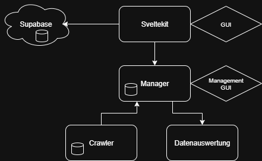
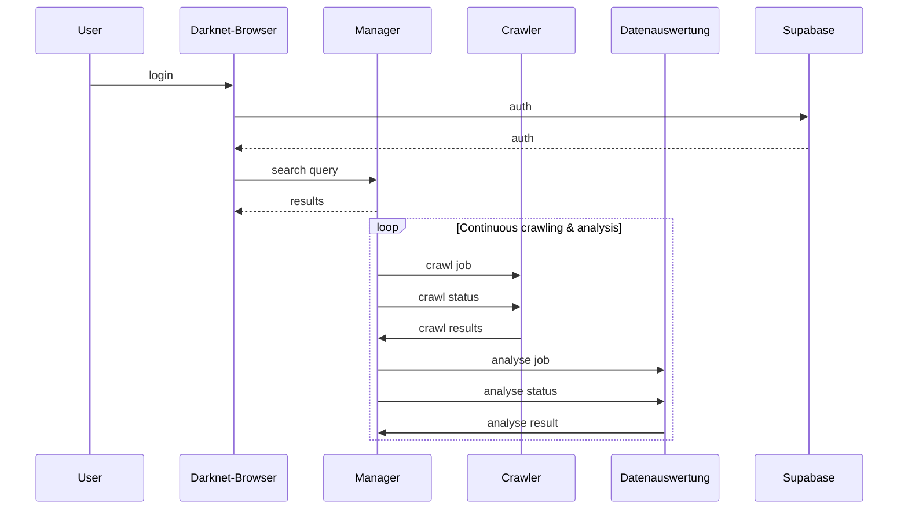

# Darkwebsearch
A microservice-based platform to search, crawl, and analyze clear text data from the dark web, built with Python backend services, SvelteKit frontend, Supabase authentication, and distributed MySQL databases.

## Project Structure
The application is composed of four main microservices, each developed and maintained by a team member:

| Microservice    | Description                                | Tech Stack                      | Database | Owner           |
| :-------------- | :----------------------------------------- | :------------------------------ | :------- | :-------------- |
| Sveltekit GUI   | Frontend user interface with Supabase auth | SvelteKit, Supabase Auth        | None     | Huber Elena     |
| Manager         | Orchestrates microservices, Management GUI | Python (Flask), MySQL           | MySQL    | Mark Sperle     |
| Crawler         | Scrapes and collects data from dark web    | Python (Flask), Selenium, MySQL | MySQL    | Lukas Troedsson |
| Data Analysis   | Analyzes data, creates reports             | Python, MySQL                   | MySQL    | Johannes Wutte  |

## Microservices

### Sveltekit GUI
- GUI based on a google search
- Manages user accounts with supabase

### Manager
- Orchestrates Crawler and Data analysis Service
- Keeps database of raw crawled data as well as analysed data
- Manages search querys from Sveltekit
- (Caching Search queries)

### Crawler
- Crawling sites using libraries like `selenium` & `requests`
- Extract links from HTML code and follow them
- Check robots.txt or sitemap.xml
- Rate Limiting
- Simple GUI to change crawler settings (Embedded in Manger)
- (Multithreading)

### Data analysis
- Analyzes data from Crawler
- Returns resulting tags to the Manager
- Simple GUI to change analysis settings (Embedded in Manger)
- (Multithreading)

## Sequence Diagram

