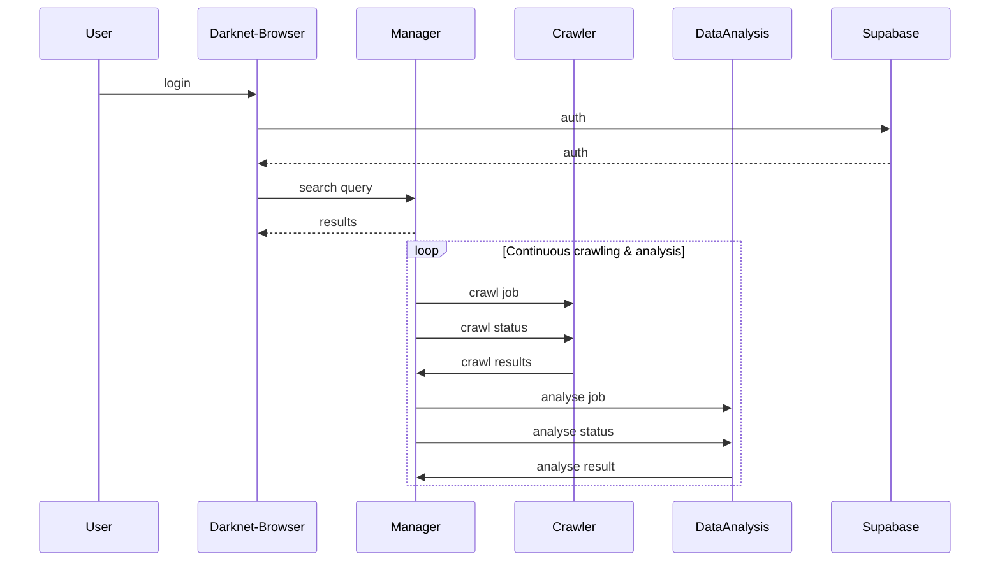
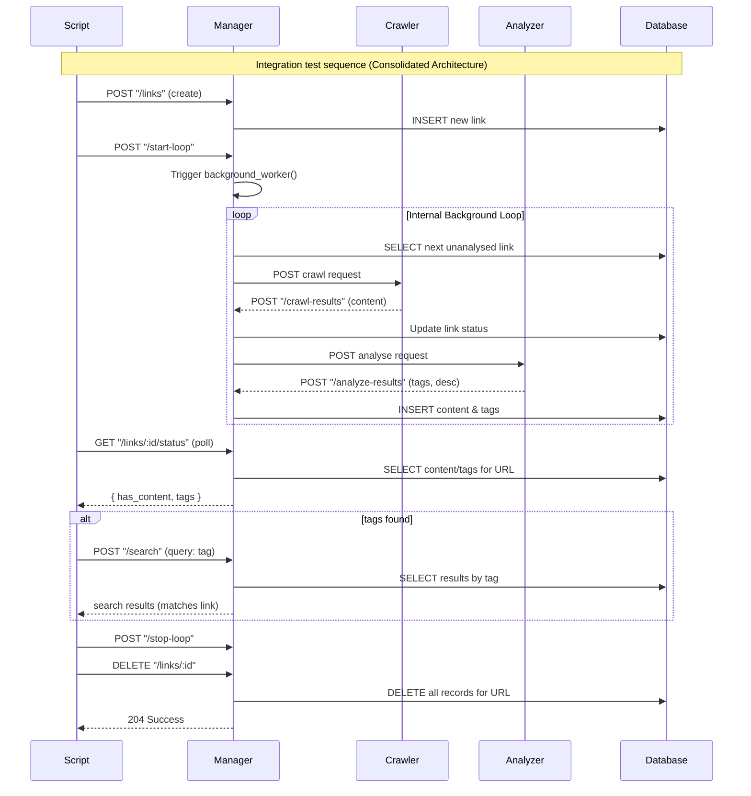

# Darkwebsearch
A microservice-based platform to search, crawl, and analyze clear text data from the dark web, built with Python backend services, SvelteKit frontend, Supabase authentication, and distributed MySQL databases.

## Project Structure
The application is composed of four main microservices, each developed and maintained by a team member:


| Microservice    | Description                                | Tech Stack                      | Database | Owner           |
| :-------------- | :----------------------------------------- | :------------------------------ | :------- | :-------------- |
| Sveltekit GUI   | Frontend user interface with Supabase auth | SvelteKit, Supabase Auth        | None     | Huber Elena     |
| Manager         | Orchestrates microservices, Management GUI | Python (Flask), MySQL           | MySQL    | Mark Sperle     |
| Crawler         | Scrapes and collects data from dark web    | Python (Flask), Selenium, MySQL | MySQL    | Lukas Troedsson |
| Data Analysis   | Analyzes data, creates reports             | Python, MySQL                   | MySQL    | Johannes Wutte  |


## Microservices

### Sveltekit GUI
- GUI based on a google search
- Manages user accounts with supabase

### Manager
- Orchestrates Crawler and Data analysis Service
- Keeps a database containing content, links and tags
- Manages search querys from Sveltekit
- (Caching Search queries)

### Crawler
- Crawling sites using libraries like `selenium` & `requests`
- Extract links from HTML code and follow them
- Check robots.txt or sitemap.xml
- Rate Limiting
- Simple GUI to change crawler settings (Embedded in Manger)
- (Multithreading)

### Data analysis
- Analyzes data from Crawler
- Returns resulting tags to the Manager
- Simple GUI to change analysis settings (Embedded in Manger)
- (Multithreading)

## Sequence Diagram


# Setup

To get started, clone the repository and then navigate into the newly created directory:
```bash
git clone https://github.com/Tomatenmark05/darkwebsearch.git
cd darkwebsearch
```

Next, you need to configure several environment variables. These are crucial for the application's functionality:
```ruby
###### Manager ######
MANAGER_API_KEY=secret
MYSQL_HOST=db
MYSQL_PORT=3306
MYSQL_USER=appuser
MYSQL_DATABASE=appdb
MYSQL_PASSWORD=apppassword
MYSQL_ROOT_PASSWORD=rootpassword
PYTHONUNBUFFERED='1'
    
###### Data Analysis ######
OPENAI_API_KEY=secret
API_KEY="changeme"
MODEL_NAME="gpt-4.1-mini"
CALLBACK_URL="http://manager:8000/analyze-results"
    
###### Browser ######  
# Fronted - browser
PUBLIC_SUPABASE_URL=changeme
PUBLIC_SUPABASE_KEY=changeme
# Backend only Server
SUPABASE_SERVICE_ROLE_KEY=changeme
SUPABASE_URL=changeme
MANAGER_SERVICE_URL=http://manager:8000
```
Important: All values marked with `changeme` **must** be updated for the application to function correctly. This includes configuring your Supabase connection and AI integration details.

## Starting
You can then start the container stack using:
```shell
docker compose up --build -d
```

The Tor container, essential for the crawler, typically takes the longest to initialize. To verify when the application is ready for use, monitor its logs:
```bash
docker logs tor -f
```
This process may take some time, depending on your network connection and the Tor network's status.

Once you see the following line, the system should be fully operational:
```ruby
Bootstrapped 100% (done): Done
```

## Access
After all services have started successfully, the darkweb browser will be accessible at http://localhost:3000.

The backend APIs are also available at the following addresses:
- manager: http://localhost:8001
- crawler: http://localhost:8080
- data-analyser: http://localhost:8000

Upon accessing the browser, you will be presented with a login screen. Valid credentials for this screen depend on your Supabase setup. For the provided test user, the credentials are:
```
test@example.com/Pa$$w0rd
```

After logging in, you will see a standard search bar with a distinctive 'hacking' aesthetic. Currently, the database is not populated with information, so an additional step is required to enrich the data.

## Data enrichment
The browser's core functionality relies on a comprehensive list of dark web links. Users of this platform are responsible for managing and maintaining this list.

This list is stored in the `List` table within the database connected to the manager service.

A seeding list is provided, meaning the `List` table will already contain 5 entries after the initial build:
```ruby
"http://zkj7mzglnrbvu3elepazau7ol26cmq7acryvsqxvh4sreoydhzin7zid.onion",
"http://cr32aykujaxqkfqyrjvt7lxovnadpgmghtb3y4g6jmx6oomr572kbuqd.onion",
"http://f6wqhy6ii7metm45m4mg6yg76yytik5kxe6h7sestyvm6gnlcw3n4qad.onion",
"http://zwf5i7hiwmffq2bl7euedg6y5ydzze3ljiyrjmm7o42vhe7ni56fm7qd.onion",
"http://z7s2w5vruxbp2wzts3snxs24yggbtdcdj5kp2f6z5gimouyh3wiaf7id.onion"
```

However, these links must first be analyzed and crawled before they can be searched.

To initiate this process, activate the data enrichment loop via the manager API:
```bash
curl -X 'POST' \
  'http://localhost:8001/start-loop' \
  -H 'accept: application/json' \
  -d ''
```

If you monitor the Docker stack logs, you will observe the data enrichment process unfolding until you see output similar to this:
```ruby
manager-1               | Loop start
manager-1               | {}
manager-1               | All links already analysed
manager-1               | Loop start
manager-1               | {}
manager-1               | All links already analysed
manager-1               | Loop start
manager-1               | {}
```

This indicates that the data enrichment process is complete, and you can then stop the loop:
```bash
curl -X 'POST' \
  'http://localhost:8001/stop-loop' \
  -H 'accept: application/json' \
  -d ''
```

With the database tables now populated with data, you can proceed with searching.

Please note that we are currently limited to five URLs, so the results might not yield any data. However, a widely recognized term such as `bitcoin` should typically return some values.
# Integration Tests

## Manager Loop
The integration test `tests/loop_integration.py` automates a full end-to-end check of the manager service. It performs the following sequence of actions:
- Creates a new link using **POST /links/**.
- Starts the manager loop with **POST /start-loop**.
- Polls **GET /links/{id}/status** until the link has been analyzed and tags are present.
- Searches for the first returned tag using **POST /search** to verify the created link appears in the results.
- Once verified, it stops the loop with **POST /stop-loop**.
- Finally, it deletes the link using **DELETE /links/{id}**.

Prerequisites: the manager API must be reachable (default `http://localhost:8001`) and the `requests` package installed. Run it with:
```bash
MANAGER_URL=http://localhost:8001 python3 tests/loop_integration.py
```

The flow of the integration test can be described as follows:

